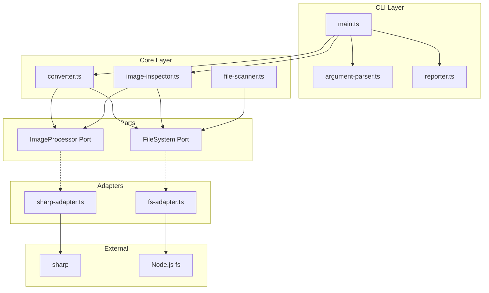
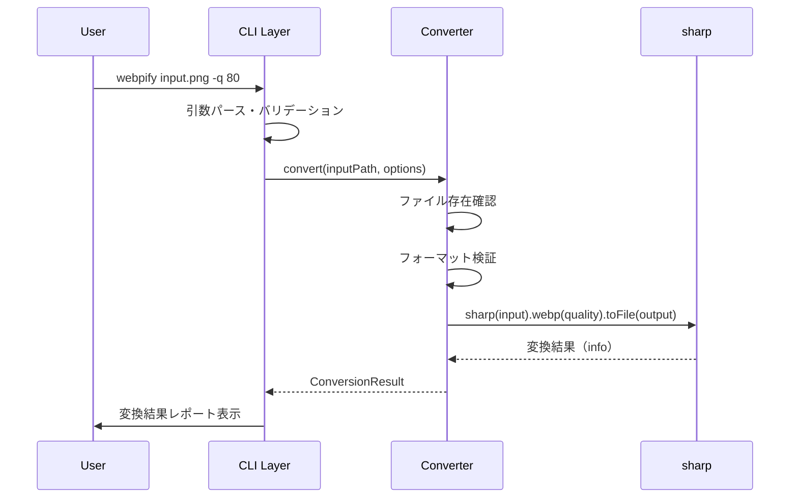
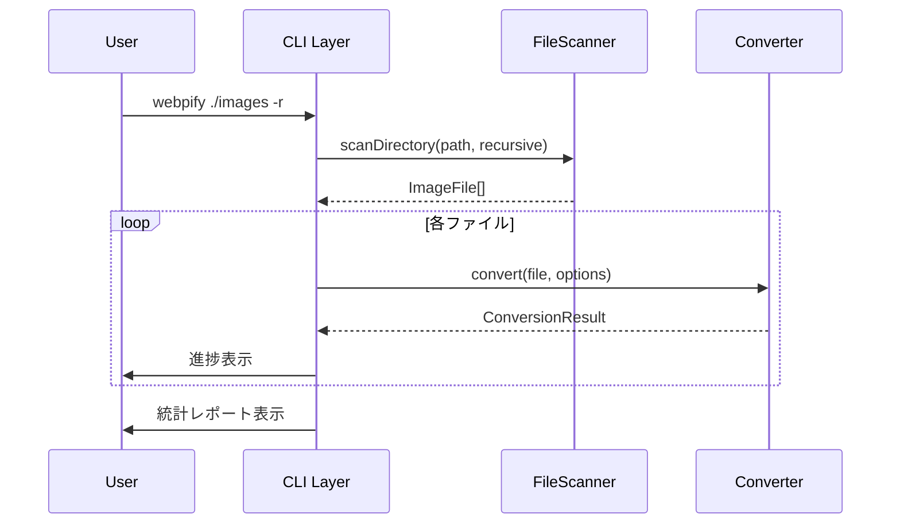
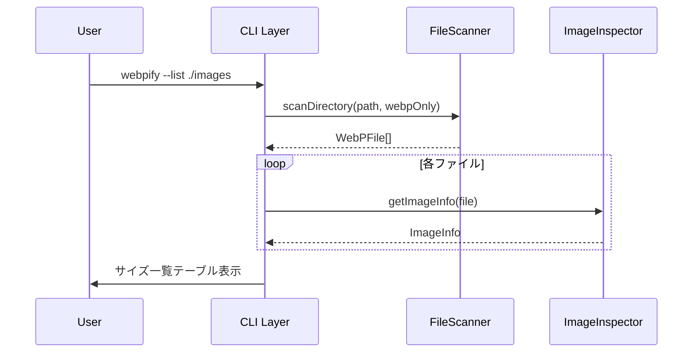

# Technical Design Document

## Overview

**Purpose**: webpify は PNG、JPEG、GIF 形式の画像を WebP 形式に変換し、Web パフォーマンス向上のためのファイルサイズ最適化を提供する。

**Users**: Web 開発者が画像アセットの最適化、CI/CD パイプラインでの自動変換に使用する。

**Impact**: 新規 CLI ツールとして、画像変換と WebP ファイル一覧表示機能を提供する。

### Goals

- 単一ファイルおよびディレクトリ単位での WebP 変換
- 品質パラメータによる出力制御
- 既存 WebP ファイルのサイズ一覧表示
- 変換結果の統計レポート出力

### Non-Goals

- AVIF、HEIF など WebP 以外の出力形式サポート
- 画像のリサイズ・クロップ機能
- GUI インターフェース
- Web サービスとしての提供

## Architecture

### Architecture Pattern & Boundary Map

**選択パターン**: Layered Architecture（2 層構造）

CLI 層とコア層を明確に分離し、テスタビリティと保守性を確保する。



**Testability Design**:
- **Ports & Adapters**: 外部依存（sharp, fs）をポートインターフェースで抽象化
- **Dependency Injection**: 各コンポーネントはコンストラクタでポートを受け取る
- **Mock Injection**: テスト時はモック実装を注入可能

**Architecture Integration**:
- **Selected pattern**: Layered — CLI 層がユーザー入力を処理し、Core 層がビジネスロジックを実行
- **Domain boundaries**: CLI（入出力）と Core（変換ロジック）を分離
- **Existing patterns preserved**: steering の structure.md に定義された `/src/cli/`、`/src/core/` 構成に準拠
- **New components rationale**: 各コンポーネントは単一責任を持ち、テスト可能
- **Steering compliance**: kebab-case ファイル命名、TypeScript strict モードを維持

### Technology Stack

| Layer | Choice / Version | Role in Feature | Notes |
|-------|------------------|-----------------|-------|
| CLI | Commander.js 13.x | 引数パース、ヘルプ生成 | 軽量で TypeScript 対応 |
| Image Processing | sharp 0.34.x | WebP 変換、メタデータ取得 | libvips ベースの高速処理 |
| Runtime | Node.js 22 LTS | 実行環境 | sharp の要件を満たす |
| Build | TypeScript 5.x | 型安全なコンパイル | strict モード |
| Testing | vitest 4.x | ユニット/統合テスト | 高速、ESM ネイティブ対応 |
| Package Manager | pnpm 10.26.2 | 依存関係管理 | steering で指定済み |

## System Flows

### 単一ファイル変換フロー



### ディレクトリ一括変換フロー



### WebP サイズ一覧表示フロー



## Requirements Traceability

| Requirement | Summary | Components | Interfaces | Flows |
|-------------|---------|------------|------------|-------|
| 1.1-1.5 | 単一ファイル変換 | Converter, ArgumentParser | ConvertOptions, ConversionResult | 単一ファイル変換 |
| 2.1-2.3 | 出力先指定 | Converter, ArgumentParser | ConvertOptions | 単一ファイル変換 |
| 3.1-3.3 | 品質設定 | Converter, ArgumentParser | ConvertOptions | 単一ファイル変換 |
| 4.1-4.4 | ディレクトリ一括変換 | Converter, FileScanner, Reporter | ConvertOptions, ScanOptions | ディレクトリ一括変換 |
| 5.1-5.3 | 上書き制御 | Converter | ConvertOptions | 単一/ディレクトリ変換 |
| 6.1-6.3 | ヘルプ・バージョン | ArgumentParser | — | — |
| 7.1-7.3 | 変換結果レポート | Reporter | ConversionResult, ConversionStats | 全変換フロー |
| 8.1-8.6 | WebP サイズ一覧 | ImageInspector, FileScanner, Reporter | ImageInfo, ListOptions | WebP 一覧表示 |

## Components and Interfaces

### Summary

| Component | Domain/Layer | Intent | Req Coverage | Key Dependencies | Contracts |
|-----------|--------------|--------|--------------|------------------|-----------|
| main.ts | CLI | エントリポイント、実行制御 | All | ArgumentParser, Converter, Reporter | — |
| ArgumentParser | CLI | コマンドライン引数のパース | 6.1-6.3 | Commander.js (P0) | Service |
| Reporter | CLI | 結果出力・進捗表示 | 7.1-7.3, 4.3 | — | Service |
| Converter | Core | WebP 変換処理 | 1.1-5.3 | sharp (P0), FileScanner (P1) | Service |
| FileScanner | Core | ファイル探索・フィルタリング | 4.1-4.2, 8.2-8.3 | Node.js fs (P0) | Service |
| ImageInspector | Core | 画像メタデータ取得 | 8.1-8.6 | sharp (P0) | Service |

### CLI Layer

#### ArgumentParser

| Field | Detail |
|-------|--------|
| Intent | コマンドライン引数をパースし、型安全なオプションオブジェクトを生成 |
| Requirements | 6.1, 6.2, 6.3 |

**Responsibilities & Constraints**
- Commander.js を使用した引数定義とパース
- オプション値のバリデーション（品質値の範囲チェック等）
- ヘルプメッセージとバージョン情報の生成

**Dependencies**
- External: Commander.js — CLI フレームワーク (P0)

**Contracts**: Service [x]

##### Service Interface

```typescript
interface ParsedOptions {
  input: string;
  output?: string;
  quality: number;
  recursive: boolean;
  force: boolean;
  quiet: boolean;
  list: boolean;
}

interface ArgumentParserService {
  parse(argv: string[]): ParsedOptions;
  showHelp(): void;
  showVersion(): void;
}
```

- Preconditions: argv は process.argv 形式の配列
- Postconditions: 有効な ParsedOptions を返却、または無効な入力でプロセス終了
- Invariants: quality は 1-100 の範囲内

#### Reporter

| Field | Detail |
|-------|--------|
| Intent | 変換結果と統計情報をフォーマットして出力 |
| Requirements | 7.1, 7.2, 7.3, 4.3 |

**Responsibilities & Constraints**
- 単一ファイル変換結果の表示
- バッチ変換の進捗表示
- 統計サマリーの生成（ファイル数、成功数、削減量）
- WebP 一覧のテーブル形式出力
- quiet モード時の出力抑制

**Dependencies**
- Inbound: main.ts — 結果データの受け渡し (P0)

**Contracts**: Service [x]

##### Service Interface

```typescript
interface ConversionResult {
  inputPath: string;
  outputPath: string;
  inputSize: number;
  outputSize: number;
  skipped: boolean;
  error?: string;
}

interface ConversionStats {
  totalFiles: number;
  successCount: number;
  skippedCount: number;
  errorCount: number;
  totalInputSize: number;
  totalOutputSize: number;
}

interface ImageListItem {
  path: string;
  size: number;
  width: number;
  height: number;
}

interface ReporterService {
  reportConversion(result: ConversionResult, quiet: boolean): void;
  reportProgress(current: number, total: number, fileName: string): void;
  reportStats(stats: ConversionStats): void;
  reportImageList(items: ImageListItem[]): void;
}
```

### Core Layer

#### Converter

| Field | Detail |
|-------|--------|
| Intent | 画像ファイルを WebP 形式に変換 |
| Requirements | 1.1, 1.2, 1.3, 1.4, 1.5, 2.1, 2.2, 2.3, 3.1, 3.2, 3.3, 5.1, 5.2, 5.3 |

**Responsibilities & Constraints**
- 入力ファイルの存在確認とフォーマット検証
- ImageProcessor ポートを使用した WebP 変換
- 出力パスの決定と出力ディレクトリの作成
- 上書き制御（force オプションによる制御）
- エラーハンドリングと結果報告

**Dependencies**
- Inbound: ImageProcessor — 画像処理ポート (P0)
- Inbound: FileSystem — ファイルシステムポート (P0)
- Outbound: FileScanner — ファイル探索 (P1)

**Contracts**: Service [x]

##### Service Interface

```typescript
type SupportedFormat = 'png' | 'jpeg' | 'jpg' | 'gif';

interface ConvertOptions {
  output?: string;
  quality: number;
  force: boolean;
}

// 依存性注入用のポートインターフェース
interface ImageProcessorPort {
  convertToWebP(
    inputPath: string,
    outputPath: string,
    options: { quality: number }
  ): Promise<{ size: number }>;
  getMetadata(filePath: string): Promise<{ width: number; height: number; format: string }>;
}

interface FileSystemPort {
  exists(path: string): Promise<boolean>;
  isDirectory(path: string): Promise<boolean>;
  readDir(path: string): Promise<string[]>;
  readDirRecursive(path: string): Promise<string[]>;
  mkdir(path: string): Promise<void>;
  stat(path: string): Promise<{ size: number }>;
}

// Converter はコンストラクタでポートを受け取る（依存性注入）
interface ConverterDependencies {
  imageProcessor: ImageProcessorPort;
  fileSystem: FileSystemPort;
}

interface ConverterService {
  convert(inputPath: string, options: ConvertOptions): Promise<ConversionResult>;
  convertBatch(
    inputPaths: string[],
    options: ConvertOptions,
    onProgress?: (result: ConversionResult, index: number, total: number) => void
  ): Promise<ConversionStats>;
  isSupportedFormat(filePath: string): boolean;
}

// ファクトリ関数（本番用とテスト用で依存を差し替え可能）
function createConverter(deps: ConverterDependencies): ConverterService;
```

- Preconditions: inputPath は存在するファイルへのパス
- Postconditions: 変換成功時は出力ファイルが作成される
- Invariants: quality は 1-100、サポート形式は PNG/JPEG/GIF

**Implementation Notes**
- Integration: ImageProcessorPort を通じて変換、テスト時はモック注入
- Validation: 入力ファイルの存在確認、フォーマット検証を変換前に実行
- Risks: 大量ファイル処理時のメモリ使用量 → 順次処理で対応

#### FileScanner

| Field | Detail |
|-------|--------|
| Intent | ディレクトリ内の画像ファイルを探索・フィルタリング |
| Requirements | 4.1, 4.2, 4.4, 8.2, 8.3 |

**Responsibilities & Constraints**
- ディレクトリの再帰的走査
- 拡張子によるフィルタリング（変換対象/WebP のみ）
- ファイルパスのリスト生成

**Dependencies**
- External: Node.js fs/path — ファイルシステム操作 (P0)

**Contracts**: Service [x]

##### Service Interface

```typescript
interface ScanOptions {
  recursive: boolean;
  extensions: string[];
}

interface FileScannerService {
  scan(directoryPath: string, options: ScanOptions): Promise<string[]>;
  isDirectory(path: string): Promise<boolean>;
  exists(path: string): Promise<boolean>;
}
```

- Preconditions: directoryPath は存在するディレクトリ
- Postconditions: 条件に一致するファイルパスの配列を返却

#### ImageInspector

| Field | Detail |
|-------|--------|
| Intent | 画像ファイルのメタデータ（サイズ、寸法）を取得 |
| Requirements | 8.1, 8.4, 8.6 |

**Responsibilities & Constraints**
- sharp を使用した画像メタデータ取得
- ファイルサイズの取得（fs.stat）
- 寸法（width, height）の取得

**Dependencies**
- External: sharp — メタデータ取得 (P0)
- External: Node.js fs — ファイルサイズ取得 (P0)

**Contracts**: Service [x]

##### Service Interface

```typescript
interface ImageInfo {
  path: string;
  size: number;
  width: number;
  height: number;
  format: string;
}

interface ImageInspectorService {
  getInfo(filePath: string): Promise<ImageInfo>;
  getInfoBatch(filePaths: string[]): Promise<ImageInfo[]>;
}
```

## Data Models

### Domain Model

本 CLI ツールはステートレスな変換処理のため、永続化が必要なドメインモデルは存在しない。

**Value Objects**:
- `ConvertOptions`: 変換オプション（品質、出力先、強制上書き）
- `ConversionResult`: 単一ファイルの変換結果
- `ConversionStats`: バッチ変換の統計情報
- `ImageInfo`: 画像メタデータ

**Business Rules**:
- 品質値は 1-100 の範囲内
- サポート形式は PNG、JPEG、GIF のみ
- 出力ファイル名は入力ファイル名 + `.webp`
- 既存ファイルはデフォルトでスキップ、`--force` で上書き

## Error Handling

### Error Strategy

エラーは早期に検出し、ユーザーに明確なメッセージを表示して終了コード 1 で終了する。

### Error Categories and Responses

**User Errors (Exit Code 1)**:
- ファイルが存在しない → `Error: File not found: <path>`
- サポート外フォーマット → `Error: Unsupported format: <ext>. Supported: png, jpeg, jpg, gif`
- 品質値が範囲外 → `Error: Quality must be between 1 and 100`
- 引数不足 → ヘルプメッセージを表示

**System Errors (Exit Code 1)**:
- ファイル書き込み失敗 → `Error: Failed to write file: <path>`
- sharp 処理エラー → `Error: Image processing failed: <message>`

**Warnings (Exit Code 0)**:
- 変換対象ファイルなし → `Warning: No convertible files found`
- ファイルスキップ → `Skipped: <path> (file already exists)`

## Testing Strategy

### Test Framework & Configuration

**Framework**: vitest 4.x

```typescript
// vitest.config.ts
import { defineConfig } from 'vitest/config';

export default defineConfig({
  test: {
    globals: true,
    environment: 'node',
    include: ['src/**/*.test.ts'],
    coverage: {
      provider: 'v8',
      reporter: ['text', 'html'],
      include: ['src/**/*.ts'],
      exclude: ['src/**/*.test.ts', 'src/types/**'],
    },
  },
});
```

### Mock Strategy

**依存性注入によるモック**:

ポートインターフェースを使用し、テスト時にモック実装を注入する。

```typescript
// tests/mocks/image-processor.mock.ts
import { vi } from 'vitest';
import type { ImageProcessorPort } from '../src/ports/image-processor';

export function createMockImageProcessor(): ImageProcessorPort {
  return {
    convertToWebP: vi.fn().mockResolvedValue({ size: 1024 }),
    getMetadata: vi.fn().mockResolvedValue({ width: 800, height: 600, format: 'png' }),
  };
}

// tests/mocks/file-system.mock.ts
import { vi } from 'vitest';
import type { FileSystemPort } from '../src/ports/file-system';

export function createMockFileSystem(): FileSystemPort {
  return {
    exists: vi.fn().mockResolvedValue(true),
    isDirectory: vi.fn().mockResolvedValue(false),
    readDir: vi.fn().mockResolvedValue([]),
    readDirRecursive: vi.fn().mockResolvedValue([]),
    mkdir: vi.fn().mockResolvedValue(undefined),
    stat: vi.fn().mockResolvedValue({ size: 2048 }),
  };
}
```

### Unit Tests

**対象**: ビジネスロジック（外部依存なし）

```typescript
// src/core/converter.test.ts
import { describe, it, expect, vi, beforeEach } from 'vitest';
import { createConverter } from './converter';
import { createMockImageProcessor } from '../../tests/mocks/image-processor.mock';
import { createMockFileSystem } from '../../tests/mocks/file-system.mock';

describe('Converter', () => {
  let mockImageProcessor: ReturnType<typeof createMockImageProcessor>;
  let mockFileSystem: ReturnType<typeof createMockFileSystem>;
  let converter: ReturnType<typeof createConverter>;

  beforeEach(() => {
    mockImageProcessor = createMockImageProcessor();
    mockFileSystem = createMockFileSystem();
    converter = createConverter({
      imageProcessor: mockImageProcessor,
      fileSystem: mockFileSystem,
    });
  });

  describe('isSupportedFormat', () => {
    it('should return true for png files', () => {
      expect(converter.isSupportedFormat('image.png')).toBe(true);
    });

    it('should return false for unsupported formats', () => {
      expect(converter.isSupportedFormat('image.bmp')).toBe(false);
    });
  });

  describe('convert', () => {
    it('should convert file and return result', async () => {
      const result = await converter.convert('input.png', { quality: 80, force: false });

      expect(mockImageProcessor.convertToWebP).toHaveBeenCalledWith(
        'input.png',
        'input.webp',
        { quality: 80 }
      );
      expect(result.skipped).toBe(false);
    });

    it('should skip if output exists and force is false', async () => {
      mockFileSystem.exists.mockResolvedValueOnce(true); // input exists
      mockFileSystem.exists.mockResolvedValueOnce(true); // output exists

      const result = await converter.convert('input.png', { quality: 80, force: false });

      expect(result.skipped).toBe(true);
      expect(mockImageProcessor.convertToWebP).not.toHaveBeenCalled();
    });
  });
});
```

**テストケース一覧**:

- `ArgumentParser`: オプションパース、バリデーション、デフォルト値
- `Converter.isSupportedFormat`: 各拡張子の判定（png, jpeg, jpg, gif, bmp, webp）
- `Converter.convert`: 正常変換、スキップ、エラーハンドリング
- `FileScanner.scan`: ディレクトリ走査、フィルタリング、再帰オプション
- `Reporter`: 出力フォーマット（サイズ表示、パーセント計算）
- `ImageInspector.getInfo`: メタデータ取得

### Integration Tests

**対象**: 実際の sharp/fs を使用した統合テスト

```typescript
// tests/integration/converter.integration.test.ts
import { describe, it, expect, beforeAll, afterAll } from 'vitest';
import { createConverter } from '../../src/core/converter';
import { createSharpAdapter } from '../../src/adapters/sharp-adapter';
import { createFsAdapter } from '../../src/adapters/fs-adapter';
import fs from 'node:fs/promises';
import path from 'node:path';

describe('Converter Integration', () => {
  const testDir = path.join(__dirname, 'fixtures');
  const outputDir = path.join(__dirname, 'output');

  beforeAll(async () => {
    await fs.mkdir(outputDir, { recursive: true });
  });

  afterAll(async () => {
    await fs.rm(outputDir, { recursive: true, force: true });
  });

  it('should convert PNG to WebP', async () => {
    const converter = createConverter({
      imageProcessor: createSharpAdapter(),
      fileSystem: createFsAdapter(),
    });

    const result = await converter.convert(
      path.join(testDir, 'sample.png'),
      { quality: 80, force: true, output: outputDir }
    );

    expect(result.skipped).toBe(false);
    expect(result.outputSize).toBeLessThan(result.inputSize);
  });
});
```

**テストシナリオ**:

- 単一ファイル変換（PNG → WebP）
- ディレクトリ一括変換（再帰あり/なし）
- 上書き制御（force オプション）
- WebP 一覧表示
- エラーケース（ファイル不存在、サポート外フォーマット）

### E2E Tests

**対象**: CLI 全体の動作確認

```typescript
// tests/e2e/cli.e2e.test.ts
import { describe, it, expect } from 'vitest';
import { execa } from 'execa';
import path from 'node:path';

describe('CLI E2E', () => {
  const cli = path.join(__dirname, '../../dist/index.js');

  it('should show help with --help', async () => {
    const { stdout } = await execa('node', [cli, '--help']);
    expect(stdout).toContain('Usage:');
    expect(stdout).toContain('--quality');
  });

  it('should show version with --version', async () => {
    const { stdout } = await execa('node', [cli, '--version']);
    expect(stdout).toMatch(/\d+\.\d+\.\d+/);
  });

  it('should convert image file', async () => {
    const { stdout, exitCode } = await execa('node', [
      cli, 'tests/fixtures/sample.png', '-q', '80'
    ]);
    expect(exitCode).toBe(0);
  });
});
```

**テストコマンド**:

- `webpify input.png` — 基本変換
- `webpify input.png -o output.webp -q 90` — オプション指定
- `webpify ./images -r` — ディレクトリ再帰変換
- `webpify --list ./images` — 一覧表示
- `webpify --help` — ヘルプ表示
- `webpify --version` — バージョン表示

### Test Directory Structure

```
tests/
├── mocks/
│   ├── image-processor.mock.ts
│   └── file-system.mock.ts
├── fixtures/
│   ├── sample.png
│   ├── sample.jpg
│   └── sample.gif
├── integration/
│   └── converter.integration.test.ts
└── e2e/
    └── cli.e2e.test.ts

src/
├── core/
│   ├── converter.ts
│   └── converter.test.ts  # Unit tests colocated
├── cli/
│   ├── argument-parser.ts
│   └── argument-parser.test.ts
└── ...
```
