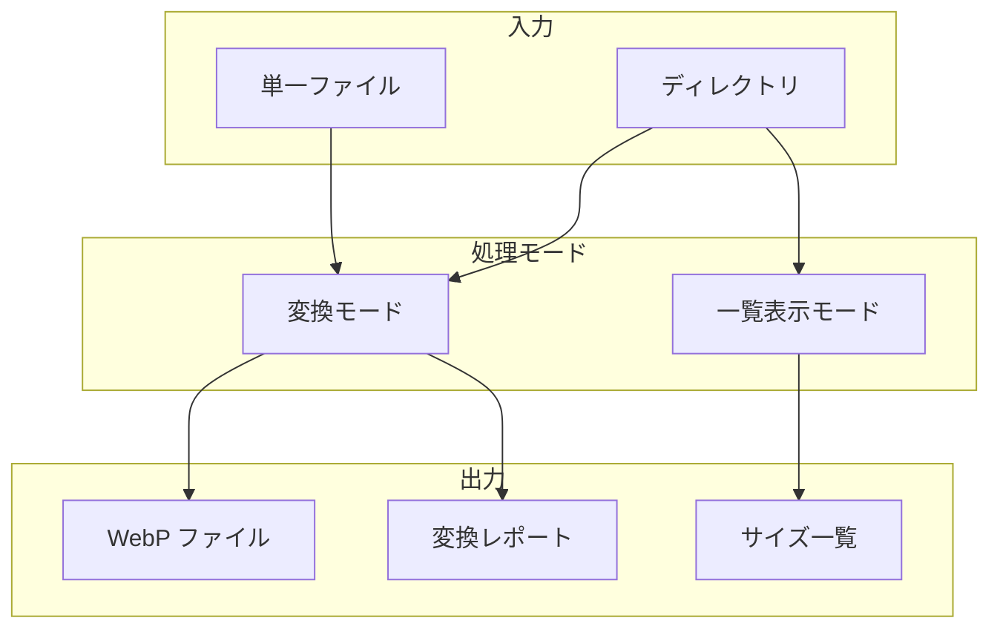

# CLI コマンドリファレンス

webpify のすべてのコマンドとオプションの詳細な説明です。

## 目次

- [基本構文](#基本構文)
- [処理モード](#処理モード)
- [引数](#引数)
  - [`[input]`](#input)
- [オプション一覧](#オプション一覧)
- [オプション詳細](#オプション詳細)
  - [`-o, --output <path>`](#-o---output-path)
  - [`-q, --quality <n>`](#-q---quality-n)
  - [`-r, --recursive`](#-r---recursive)
  - [`-f, --force`](#-f---force)
  - [`--lossless`](#--lossless)
  - [`--list`](#--list)
  - [`--absolute`](#--absolute)
  - [`--quiet`](#--quiet)
  - [`-v, --version`](#-v---version)
  - [`-h, --help`](#-h---help)
- [終了コード](#終了コード)
  - [エラーケース](#エラーケース)
- [出力フォーマット](#出力フォーマット)
  - [単一ファイル変換](#単一ファイル変換)
  - [ディレクトリ変換](#ディレクトリ変換)
  - [一覧表示（--list）](#一覧表示--list)
  - [スキップ時](#スキップ時)
  - [エラー時](#エラー時)
- [関連ドキュメント](#関連ドキュメント)

## 基本構文

```bash
webpify [input] [options]
```

## 処理モード



## 引数

### `[input]`

入力ファイルまたはディレクトリのパス。

| 入力タイプ    | 動作                    |
| -------- | --------------------- |
| ファイルパス   | 指定されたファイルを変換          |
| ディレクトリパス | ディレクトリ内のすべての対象ファイルを変換 |
| 指定なし     | ヘルプを表示                |

**サポート形式**: PNG, JPEG, JPG, GIF

```bash
# ファイル指定
webpify image.png
webpify ./assets/photo.jpg

# ディレクトリ指定
webpify ./images
webpify ./assets/photos
```

## オプション一覧

| オプション             | 短縮形  | 型       | デフォルト | 説明            |
| ----------------- | ---- | ------- | ----- | ------------- |
| `--output <path>` | `-o` | string  | 入力と同じ | 出力先ディレクトリ     |
| `--quality <n>`   | `-q` | number  | 100   | 品質レベル（1-100）  |
| `--recursive`     | `-r` | boolean | false | 再帰的に処理        |
| `--force`         | `-f` | boolean | false | 既存ファイルを上書き    |
| `--lossless`      | -    | boolean | false | 可逆圧縮モードで変換    |
| `--list`          | -    | boolean | false | WebP ファイル一覧表示 |
| `--absolute`      | -    | boolean | false | 一覧表示時に絶対パスで表示 |
| `--quiet`         | -    | boolean | false | 統計情報を非表示      |
| `--version`       | `-v` | -       | -     | バージョン表示       |
| `--help`          | `-h` | -       | -     | ヘルプ表示         |

## オプション詳細

### `-o, --output <path>`

変換後のファイルの出力先ディレクトリを指定します。

- 指定しない場合、入力ファイルと同じディレクトリに出力
- ディレクトリが存在しない場合は自動的に作成

```bash
# ./output に出力
webpify image.png -o ./output

# ./webp-images に出力（ディレクトリ変換）
webpify ./images -o ./webp-images
```

### `-q, --quality <n>`

変換時の品質レベルを指定します。

- **範囲**: 1-100
- **デフォルト**: 100
- 値が小さいほどファイルサイズは小さくなりますが、画質は低下します

```bash
# 品質 100（最高品質、デフォルト）
webpify image.png

# 品質 80（バランス重視）
webpify image.png -q 80

# 品質 50（容量重視）
webpify image.png -q 50
```

**エラー**: 範囲外の値を指定すると終了コード 1 で終了します。

```bash
# エラー例
webpify image.png -q 150
# Error: Quality must be between 1 and 100. Received: 150
```

### `-r, --recursive`

ディレクトリ変換時にサブディレクトリも再帰的に処理します。

```bash
# サブディレクトリも含めて変換
webpify ./images -r

# 出力先指定と組み合わせ
webpify ./images -r -o ./webp-output
```

### `-f, --force`

出力先に同名のファイルが既に存在する場合、上書きします。

- 指定しない場合、既存ファイルはスキップされます

```bash
# 既存ファイルを上書き
webpify image.png -f

# ディレクトリ変換で上書き
webpify ./images -f
```

### `--lossless`

可逆圧縮（lossless）モードで変換します。

- 元の画像データを完全に保持します
- ファイルサイズは元より大きくなる場合があります（特に JPEG からの変換時）
- `--quality` オプションと同時に指定した場合、警告を表示し lossless を優先します

```bash
# lossless モードで変換
webpify image.png --lossless

# ディレクトリを lossless で変換
webpify ./images --lossless

# --quality と同時指定（警告が表示され、lossless が優先）
webpify image.png --lossless --quality 80
# 警告: --lossless と --quality が同時に指定されています。lossless モードでは quality は無視されます。
```

**用途**:

- 画像アーカイブ
- 原本の保存
- PNG からの変換（品質劣化なし）
- 画質を一切落としたくない場合

### `--list`

指定したパス内の WebP ファイルのサイズ情報を一覧表示します。

- 変換処理は実行されません
- `-r` と組み合わせてサブディレクトリも対象にできます
- デフォルトで相対パスを表示（サブディレクトリ内のファイルを区別可能）
- `--absolute` と組み合わせて絶対パス表示も可能

```bash
# カレントディレクトリの WebP を一覧
webpify . --list

# サブディレクトリも含めて一覧
webpify ./images --list -r

# 絶対パスで一覧表示
webpify ./images --list -r --absolute
```

#### 出力例

```
File                       Size        Width   Height
image1.webp               45.00 KB     1920    1080
subdir/image2.webp        32.50 KB     1280     720
subdir/nested/banner.webp 12.30 KB      800     600
```

### `--absolute`

`--list` オプション使用時に、相対パスではなく絶対パスでファイルを表示します。

- `--list` オプションと組み合わせて使用
- 指定しない場合は入力ディレクトリからの相対パスを表示

```bash
# 絶対パスで一覧表示
webpify ./images --list --absolute

# 再帰 + 絶対パス
webpify ./images --list -r --absolute
```

### `--quiet`

統計情報を非表示にし、サイレントモードで実行します。

- CI/CD パイプラインでの使用に便利

```bash
# サイレントモードで実行
webpify ./images --quiet

# 再帰 + 上書き + サイレント
webpify ./images -r -f --quiet
```

### `-v, --version`

ツールのバージョン番号を表示します。

```bash
webpify -v
webpify --version
```

### `-h, --help`

使用方法とすべてのオプションの説明を表示します。

```bash
webpify -h
webpify --help
```

## 終了コード

| コード | 意味    |
| --- | ----- |
| 0   | 正常終了  |
| 1   | エラー発生 |

### エラーケース

- 指定されたファイルが存在しない
- サポートされていない形式
- 品質値が範囲外
- 画像処理中のエラー

## 出力フォーマット

### 単一ファイル変換

```
Converted: image.png (150.00 KB -> 45.00 KB, 70.0%)
```

### ディレクトリ変換

#### 進捗表示

```bash
[1/3] Processing: photo1.png
[2/3] Processing: photo2.jpg
[3/3] Processing: banner.gif
```

#### 統計サマリー

```bash
--- Conversion Stats ---
Total files: 3
Converted: 3
Skipped: 0
Errors: 0
Total size reduction: 2.50 MB (65.0%)
```

### 一覧表示（--list）

```bash
File                       Size        Width   Height
image1.webp               45.00 KB     1920    1080
subdir/image2.webp        32.50 KB     1280     720
```

### スキップ時

```bash
Skipped: image.webp (file already exists)
```

### エラー時

```bash
Error: File not found: missing.png
Error: Unsupported format: txt. Supported: png, jpeg, jpg, gif
```

## 関連ドキュメント

- [クイックスタート](./getting-started.md) - 基本的な使い方
- [ユースケース集](./use-cases.md) - 実践的な使用例
- [README](../README.md) - プロジェクト概要に戻る
