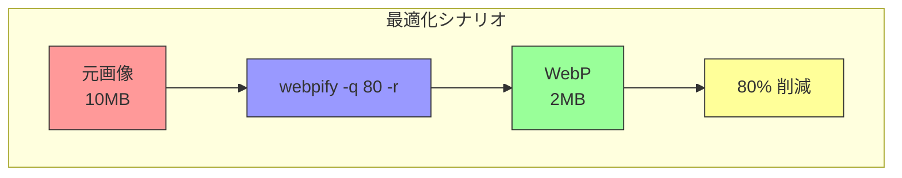

# ユースケース集

webpify の実践的な使用シナリオと具体的なコマンド例を紹介します。

## 目次

- [Web サイト最適化](#web-サイト最適化)
- [基本的なユースケース](#基本的なユースケース)
  - [単一画像の変換](#単一画像の変換)
  - [ディレクトリ内の画像を一括変換](#ディレクトリ内の画像を一括変換)
- [品質とファイルサイズの最適化](#品質とファイルサイズの最適化)
  - [高品質変換（品質 90-100）](#高品質変換品質-90-100)
  - [バランス変換（品質 70-85）](#バランス変換品質-70-85)
  - [容量重視変換（品質 50-70）](#容量重視変換品質-50-70)
- [出力先の管理](#出力先の管理)
  - [別ディレクトリに出力](#別ディレクトリに出力)
  - [元のディレクトリ構造を維持](#元のディレクトリ構造を維持)
- [大量ファイルの処理](#大量ファイルの処理)
  - [再帰的な変換](#再帰的な変換)
  - [サイレントモードでの処理](#サイレントモードでの処理)
  - [再帰 + 上書き + サイレント](#再帰--上書き--サイレント)
- [既存ファイルの管理](#既存ファイルの管理)
  - [上書き防止（デフォルト動作）](#上書き防止デフォルト動作)
  - [強制上書き](#強制上書き)
- [WebP ファイルの確認](#webp-ファイルの確認)
  - [変換結果の確認](#変換結果の確認)
  - [サブディレクトリも含めて確認](#サブディレクトリも含めて確認)
  - [変換前後の比較](#変換前後の比較)
- [CI/CD での利用](#cicd-での利用)
  - [ビルドパイプラインでの自動変換](#ビルドパイプラインでの自動変換)
  - [デプロイ前の最適化](#デプロイ前の最適化)
- [よくあるパターン](#よくあるパターン)
  - [新規プロジェクトの画像最適化](#新規プロジェクトの画像最適化)
  - [既存プロジェクトの画像最適化](#既存プロジェクトの画像最適化)
  - [品質の A/B テスト](#品質の-ab-テスト)
- [関連ドキュメント](#関連ドキュメント)

## Web サイト最適化



## 基本的なユースケース

### 単一画像の変換

最もシンプルなケース。1つの画像ファイルを変換します。

```bash
webpify hero-image.png
```

変換後は同じディレクトリに `hero-image.webp` が作成されます。

### ディレクトリ内の画像を一括変換

プロジェクトの画像アセットをまとめて変換します。

```bash
webpify ./assets/images
```

すべての PNG, JPEG, GIF ファイルが WebP に変換されます。

## 品質とファイルサイズの最適化

### 高品質変換（品質 90-100）

写真やアートワークなど、画質が重要な画像に。

```bash
# 最高品質（デフォルト）
webpify ./photos

# 品質 95
webpify ./photos -q 95
```

**用途**: ポートフォリオサイト、写真ギャラリー、商品画像

### バランス変換（品質 70-85）

ファイルサイズと画質のバランスを取りたい場合に。

```bash
webpify ./images -q 80
```

**用途**: 一般的な Web サイト画像、ブログ記事の挿入画像

### 容量重視変換（品質 50-70）

ファイルサイズを優先したい場合に。

```bash
webpify ./thumbnails -q 60
```

**用途**: サムネイル画像、背景画像、アイコン

## 出力先の管理

### 別ディレクトリに出力

元の画像を残しつつ、変換後のファイルを別のディレクトリに保存。

```bash
webpify ./images -o ./webp-images
```

#### ディレクトリ構成例

```text
project/
├── images/
│   ├── photo1.png
│   └── photo2.jpg
└── webp-images/
    ├── photo1.webp
    └── photo2.webp
```

### 元のディレクトリ構造を維持

再帰オプションと出力先を組み合わせると、サブディレクトリ構造を維持できます。

```bash
webpify ./assets -r -o ./assets-webp
```

#### 変換前

```text
assets/
├── icons/
│   └── logo.png
└── photos/
    └── hero.jpg
```

#### 変換後

```text
assets-webp/
├── icons/
│   └── logo.webp
└── photos/
    └── hero.webp
```

## 大量ファイルの処理

### 再帰的な変換

プロジェクト全体の画像を一括変換します。

```bash
webpify ./src -r
```

#### 変換対象

- `./src` 直下の画像
- `./src/components/` 内の画像
- `./src/pages/` 内の画像
- その他すべてのサブディレクトリ

### サイレントモードでの処理

大量のファイルを処理する際、進捗表示を抑制します。

```bash
webpify ./images -r --quiet
```

ログ出力なしで処理が完了します。

### 再帰 + 上書き + サイレント

既存ファイルも含めて全て再変換する場合：

```bash
webpify ./assets -r -f --quiet
```

## 既存ファイルの管理

### 上書き防止（デフォルト動作）

既存の WebP ファイルがある場合、自動的にスキップされます。

```bash
webpify ./images
```

#### 出力例

```bash
[1/3] Processing: photo1.png
Skipped: photo2.webp (file already exists)
[3/3] Processing: photo3.gif

--- Conversion Stats ---
Total files: 3
Converted: 2
Skipped: 1
```

### 強制上書き

品質を変更して再変換したい場合など、既存ファイルを上書きします。

```bash
# 既存の WebP を品質80で上書き
webpify ./images -q 80 -f
```

## WebP ファイルの確認

### 変換結果の確認

変換後のファイルサイズと画像サイズを確認します。

```bash
webpify ./images --list
```

#### 出力例

```bash
File                    Size        Width   Height
hero.webp              45.00 KB     1920    1080
thumbnail.webp         12.30 KB      400     300
banner.webp            28.50 KB     1200     400
```

### サブディレクトリも含めて確認

```bash
webpify ./assets --list -r
```

### 変換前後の比較

変換前と変換後でファイルサイズを比較したい場合：

```bash
# 1. 変換前の状態を確認（WebP がない場合はエラー）
webpify ./images --list

# 2. 変換実行
webpify ./images -q 80

# 3. 変換後の状態を確認
webpify ./images --list
```

## CI/CD での利用

### ビルドパイプラインでの自動変換

GitHub Actions や GitLab CI などで使用する例：

```bash
# すべての画像を変換（サイレント + 上書き）
webpify ./public/images -r -f --quiet
```

#### GitHub Actions の例

```yaml
- name: Install webpify
  run: npm install -g @semba-ryuichiro/webpify

- name: Convert images to WebP
  run: webpify ./public/images -r -f -q 80 --quiet
```

### デプロイ前の最適化

```bash
# 品質80で全画像を変換
webpify ./dist/assets -r -q 80 -f --quiet
```

## よくあるパターン

### 新規プロジェクトの画像最適化

```bash
# 1. 画像ディレクトリを作成
mkdir -p public/images

# 2. 画像を配置後、一括変換
webpify ./public/images -r -q 80
```

### 既存プロジェクトの画像最適化

```bash
# 1. 現状の WebP ファイルを確認
webpify ./src --list -r

# 2. 未変換の画像を変換（既存はスキップ）
webpify ./src -r -q 80

# 3. 変換結果を確認
webpify ./src --list -r
```

### 品質の A/B テスト

異なる品質で変換して比較：

```bash
# 品質 90
webpify ./original-images -q 90 -o ./test-q90

# 品質 80
webpify ./original-images -q 80 -o ./test-q80

# 品質 70
webpify ./original-images -q 70 -o ./test-q70

# サイズを比較
webpify ./test-q90 --list
webpify ./test-q80 --list
webpify ./test-q70 --list
```

## 関連ドキュメント

- [クイックスタート](./getting-started.md) - 基本的な使い方
- [コマンドリファレンス](./cli-reference.md) - すべてのオプションの詳細
- [README](../README.md) - プロジェクト概要に戻る
